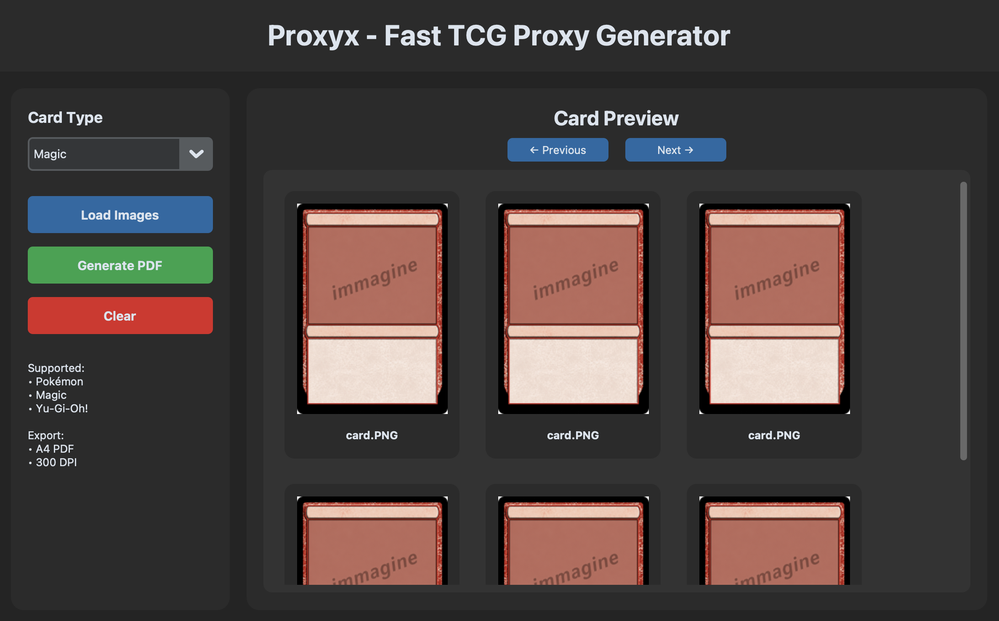
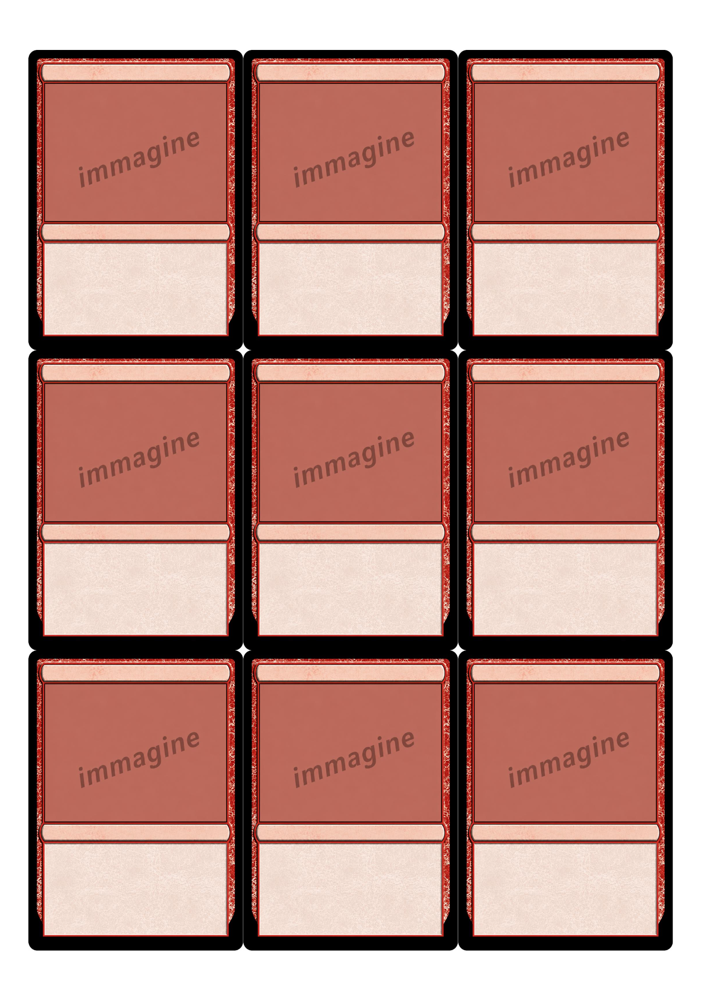

# ⚡ Proxyx - Fast TCG Proxy Generator

Generate printable TCG proxy sheets in seconds.

  
  
  
  
  

  <a href="#download">⬇ Download</a>
  ·
  <a href="#features">✨ Features</a>
  ·
  <a href="#screenshots">📸 Screenshots</a>
  ·
  <a href="#roadmap">🛣 Roadmap</a>
  ·
  <a href="#technical-details">⚙ Technical Details</a>

## ✨ Overview

Proxyx is a desktop application built to quickly generate high-quality printable proxy sheets for TCG cards.

The tool automatically arranges cards into optimized printable pages, supports preview navigation, and exports everything into clean PDF-ready layouts.

It was designed to solve a simple problem:

“I just want to print proxies fast without manually editing templates for hours.”

## 🚀 Features

✅ Modern desktop UI
 
✅ Multi-card preview grid
 
✅ Automatic printable page layout
 
✅ Pagination system for large batches
 
✅ PDF export ready for printing
 
✅ Lightweight and fast
 
✅ Local-first (no external services required)
 
✅ Built with scalability in mind

## 📸 Screenshots

### Main Interface:

  

### Generated Printable Layout:

  

## ⬇ Download

### 👉 Landing Page:

https://elianAlde.github.io/proxyx/

### 👉 Direct Download:

https://elianAlde.github.io/proxyx/downloads/proxyx-exe.zip

## 🧠 Why This Project Exists

Most TCG proxy workflows are:

* slow
* manual
* cluttered
* web-based
* annoying for bulk printing

This project focuses on:

* speed
* usability
* clean print layouts
* local processing
* minimal setup

The goal is to make proxy generation feel like a real polished desktop tool instead of a collection of scripts.

## 🛠 Tech Stack

Technology	Purpose
Python	Core application logic
CustomTkinter	Modern desktop interface
Pillow (PIL)	Image processing
ReportLab / PDF tools	Printable export generation
PyInstaller	Standalone executable packaging

## ⚙ Installation

Run from source

git clone https://github.com/elianAlde/proxyx.git
cd proxyx
pip install -r requirements.txt
python main.py

## 🖨 Printing Notes

Recommended settings:

* 100% scale
* No page fitting
* High quality print
* Thick paper or photo paper

Best results are usually obtained with:

* matte photo paper
* 300 DPI images
* corner cutter for finishing

## 🛣 Roadmap

### Upcoming Features

- [ ] 🔎 **Scryfall Integration (and other card databases)**
  - Search and import cards directly from the application
  - Official Scryfall API support
  - Additional database providers

- [ ] 🖨 **Advanced Print Controls**
  - Bleed margins
  - Crop marks
  - Printer calibration
  - DPI controls

- [ ] 📱 **Companion Mobile App**
  - Mobile-friendly proxy list management
  - Quick deck preparation
  - Synchronization with the desktop application

## 📚 Technical Details

Proxy Layout Engine

The generator automatically:

* resizes images
* preserves aspect ratios
* aligns cards into printable grids
* paginates dynamically
* optimizes spacing

The current layout system is optimized around standard TCG card proportions.

## 🤝 Contributing

Contributions, suggestions and feature requests are welcome.

If you’d like to contribute:

1. Fork the repository
2. Create a feature branch
3. Commit your changes
4. Open a pull request

## 📜 License

Distributed under the MIT License.

## ⭐ Support The Project

If you like this project:

* leave a star ⭐
* share it with TCG friends
* contribute ideas/features

It really helps.

---

Built with ❤️ for the TCG community

